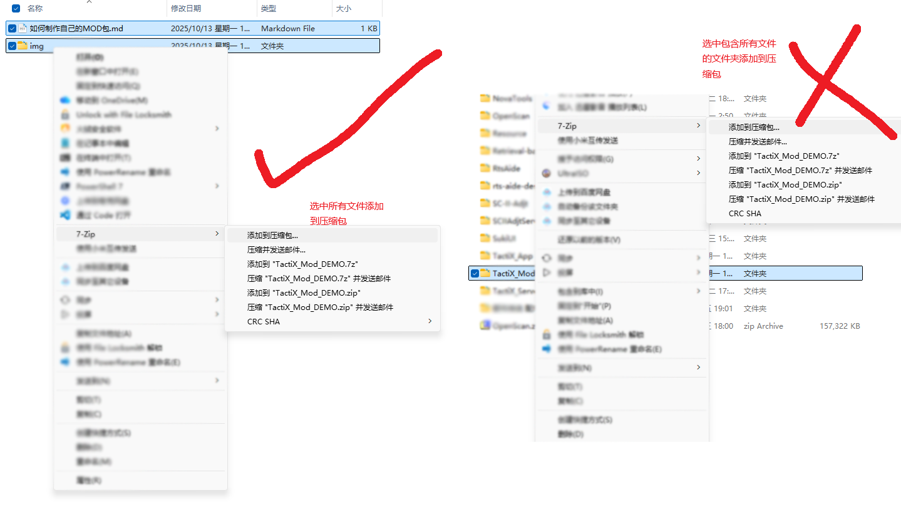

# 如何制作自己的 MOD 包

**文档更新日期：2025/10/25 18:37**

在开始制作 MOD 前，请确认已阅读《最终用户许可协议》和《隐私条款》。

**example 文件夹的内容即为一个完整MOD的范例，可作为构建参考。**


## 1. MOD 基础介绍

为了方便各位用户能够快速的创建 Tactix 支持的 MOD 包，Tactix 在构建格式上选择了 Zip 格式的压缩包。也就是说，只要按照要求创建一个压缩包即可使用，没有任何编程环节。

下文将详细介绍一个标准的MOD应该包括的内容。


## 2. MOD 包结构

**重要：MOD 包不应该包括一个根目录，详见下图。**




一个完整的 MOD 包应该包括以下内容：

| 文件夹/文件名 | 类别     | 说明                                                         |
| ------------- | -------- | ------------------------------------------------------------ |
| icons         | 文件夹   | 存放所有要显示的图标文件，**png格式，128px方形为佳**         |
| sounds        | 文件夹   | 存放所有要播放的音效文件，**wav格式，44 100 Hz (CD)，16位(CD和DAT)** |
| manifest.json | json文件 | 描述当前MOD的基本信息，包括资源索引                          |
| manifest.png  | png图片  | MOD的图标，**png格式，64px以上方形为佳**                     |
| titlebar.png  | png图片  | **(可选)**用于在战术播放界面上方展示的长方形图片，**png格式，650x140px左右为佳** |

**Wav录制工具推荐：[Nero Wave Editor (免费)](https://www.nero.com/eng/products/WaveEditor/?vlang=cn)**

可以一口气将所有单位的提示音录制后再进行切分，这样效率会比每次单独录制一条更高。

**Json编辑工具推荐：[Visual Studio Code](https://code.visualstudio.com/)**


一个实例目录树如下：

```
/ 
├── manifest.json       // MOD元数据
├── manifest.png        // MOD图标文件
├── titlebar.png        // 长方形展示图片
├── icons/              // 图标资源
│   ├── scv.png
│   └── siege_tank.png
└── sounds/             // 音频提示
    ├── scv.wav
    └── siege_tank.wav
```


## 3. manifest.json 文件格式

以下为一个标准的 manifest.json 的范本。

```json
{
  "ModName": "测试用MOD",
  "TacticsPath": "StarCraft_II",
  "ModVersion": 20251013001,
  "Actions": [
    {
      "Abbr": "Attack",
      "Desc": "前压"
    }
  ],
  "Units": [
    {
      "Abbr": "Tscv",
      "Desc": "SCV"
    }
  ],
  "Author": "作者",
  "ProjectWebSite": "https://www.123.com",
  "Email": "123456@qq.com",
  "UpdateTime": "2025-10-13 13:43",
  "Desc": "测试用的DEMO，用以演示DEMO的结构"
}
```


manifest.json 应该包括的字段如下：

| 字段名         | 备注                                                         |
| -------------- | ------------------------------------------------------------ |
| ModName        | MOD的名称                                                    |
| TacticsPath    | 该MOD使用的战术文件对应在程序Tactics目录下的子目录，**注意不要使用空格** |
| ModVersion     | MOD版本，建议使用日期+版本号，只支持数字                     |
| Actions        | 动作，除去单位/建筑外的可选动作，比如前压，侦查等            |
| ├── Abbr       | 战术文件中的内部缩写，图标和音效文件名必须与之相同           |
| └── Desc       | 描述，会在程序中显示的文本，一般是动作或单位的名称           |
| Units          | 同 Actions                                                   |
| ├── Abbr       | 同 Actions                                                   |
| └── Desc       | 同 Actions                                                   |
| Author         | 作者名称                                                     |
| ProjectWebSite | MOD项目的主页，可以是论坛发布帖的地址或个人网站等等，也可以是QQ频道的加入链接 |
| Email          | 作者联系方式，出于隐私保护个人只建议留下电子邮箱             |
| UpdateTime     | MOD 更新日期，请严格按照 **年-月-日 时:分** 的格式填写       |
| Desc           | MOD 的介绍信息                                               |


可以使用 VSCode 的 Json 支持插件确认 Json 文件的格式是否正确，也可以网页搜索 “Json在线验证“ 借助在线工具确认是否存在错误。

**TODO：开发MOD创建工具，作为后续规划。**